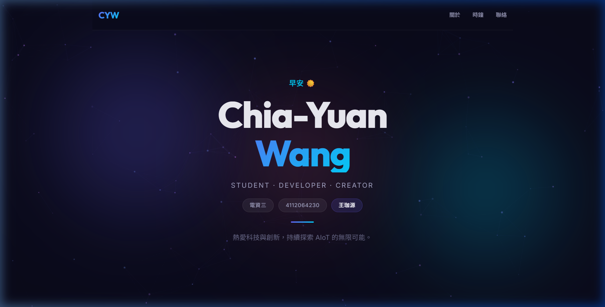
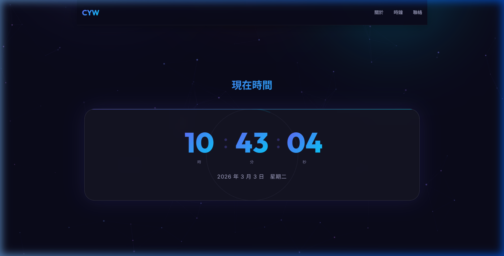
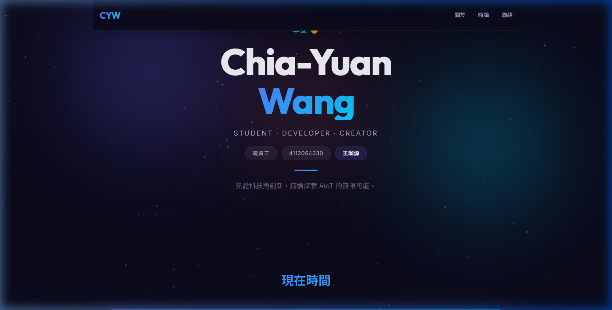
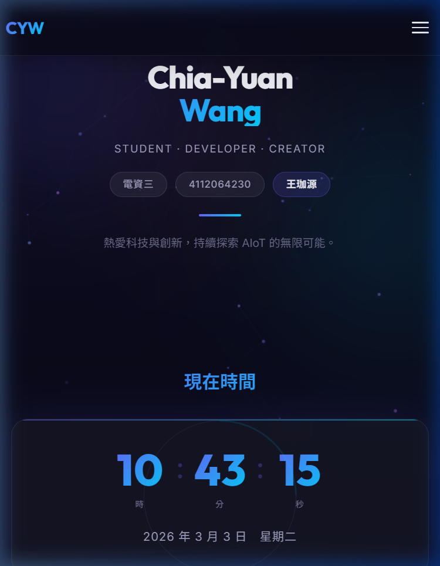

# AIoT HW1 — 個人頁面

> **作者：** 王珈源 Chia-Yuan Wang  
> **學號：** 4112064230  
> **系級：** 電資三  
> **日期：** 2026 年 3 月 3 日  
> **展示連結：** [http://blog.nobodyorz.me/AIoT_HW1/](http://blog.nobodyorz.me/AIoT_HW1/)

---

## 📋 專案概述

本專案為 AIoT 課程第一次作業，使用 **HTML5 + CSS3 + JavaScript** 建立一個具有現代設計感的**個人介紹網頁**，並即時顯示當前時間。

頁面採用深色主題搭配動態粒子背景，具備完整的 **RWD（Responsive Web Design）響應式設計**，可在桌機、平板、手機等各種裝置上完美呈現。整體設計運用玻璃擬態（Glassmorphism）、漸層色彩與微動畫等現代網頁設計技巧，營造出專業且富有科技感的視覺效果。

---

## 📸 網頁截圖

### 桌面版

**英雄區塊 — 個人資訊與學生身份**



**即時時鐘 — 每秒更新的數位時鐘**



**資訊卡片與聯絡連結**



### 行動版（RWD）

**手機版 — 自動適配小螢幕，含漢堡選單**



---

## ✨ 功能特色

| 功能 | 說明 |
|------|------|
| 🧑‍💻 個人介紹 | 顯示英文姓名、中文姓名、學號、系級與身份標籤 |
| ⏰ 即時時鐘 | 每秒更新的數位時鐘，含完整日期與星期顯示 |
| 🌌 粒子動態背景 | Canvas 繪製的星空粒子連線動畫效果 |
| 💎 玻璃擬態設計 | 毛玻璃半透明卡片搭配漸層色彩 |
| 📱 RWD 響應式設計 | 四個斷點（1024/768/480/360px）適配所有裝置 |
| 🍔 漢堡選單 | 行動版自動切換為漢堡導航選單 |
| 🎯 滾動進場動畫 | Intersection Observer API 實現淡入效果 |
| ♿ 無障礙支援 | 支援 `prefers-reduced-motion` 減少動畫偏好 |
| 🔗 真實連結 | GitHub 與 Blog 的真實個人連結 |

---

## 🛠️ 技術架構

- **HTML5** — 語意化標籤結構（`<nav>`, `<main>`, `<section>`, `<footer>`）
- **CSS3** — 自訂設計系統（CSS Custom Properties）、玻璃擬態、漸層動畫、RWD 多斷點
- **JavaScript (ES6+)** — 即時時鐘、Canvas 粒子系統、Intersection Observer API、漢堡選單互動

---

## 📁 檔案結構

```
AIoT_HW1/
├── index.html          # 主頁面 HTML 結構
├── style.css           # 完整 CSS 設計系統與 RWD 響應式樣式
├── script.js           # 時鐘更新、粒子動畫、漢堡選單互動邏輯
├── README.md           # 專案說明文件（本文件）
└── screenshots/        # 網頁截圖
    ├── desktop_hero.png
    ├── desktop_clock.png
    ├── desktop_contact.png
    └── mobile_view.png
```

---

## 🚀 使用方式

直接在瀏覽器中開啟 `index.html` 即可檢視頁面。

```bash
# 或使用任意 HTTP 伺服器
npx http-server . -p 8080
```

---

## 💬 開發對話紀錄

本專案透過與 AI 助手（Gemini / Antigravity）協作完成，以下為開發過程中的對話摘要：

### 對話 1：建立個人頁面

**我：** Please write a personal page with my name Chia-Yuan Wang, and show the current time.

**AI：** 建立了一個具有現代設計感的個人頁面，包含：
- 深色主題搭配動態粒子背景
- 英雄區塊顯示姓名與身份標籤
- 即時時鐘（每秒更新）
- 個人介紹卡片（學生、開發者、創造者）
- 聯絡連結區塊
- 完整的 CSS 設計系統與動畫效果

---

### 對話 2：推送至 GitHub

**我：** Please push this project to my repo: `git@github.com:teddywang0824/AIoT_HW1.git` and write a Project Summary in README.md with Date.

**AI：** 建立了 README.md（含專案概述、功能特色、技術架構），初始化 Git 並成功推送到 GitHub。過程中解決了遠端 repo 已有 README.md 的衝突問題。

---

### 對話 3：加入 RWD 與展示連結

**我：** Modify the code to make the web as an RWD style, and add the show link: `http://blog.nobodyorz.me/AIoT_HW1/` in README.md.

**AI：** 大幅強化 RWD 響應式設計：
- 加入漢堡選單（≤768px 自動顯示）
- 建立 4 個響應式斷點（1024/768/480/360px）
- 加入觸控裝置優化（`hover: none` 媒體查詢）
- 支援 iPhone 安全區域（`safe-area-inset`）
- 加入 `prefers-reduced-motion` 無障礙支援
- README.md 加入展示連結

---

### 對話 4：加入學生資訊

**我：** Please add my real name and student ID 電資三 4112064230 王珈源 in this web.

**AI：** 在英雄區塊加入三個玻璃擬態風格的資訊徽章（info-badge），分別顯示「電資三」、「4112064230」、「王珈源」，其中中文姓名使用紫色強調樣式。

---

### 對話 5：修正聯絡連結

**我：** I found that you already add some personal links in the web, right? But it is fake now. Please modify it. My GitHub link: `https://github.com/teddywang0824`, my blog link: `https://blog.nobodyorz.me/`. Only these two.

**AI：** 移除了假的 Email 和 LinkedIn 連結，只保留 GitHub 和 Blog 兩個真實連結，並更新了對應的圖示。

---

### 對話 6：加入截圖與對話紀錄

**我：** Please add the web screenshot in README.md, modify the summary report, and add our chat there.

**AI：** 截取了桌面版（英雄區塊、時鐘、卡片與聯絡）和行動版的網頁截圖，儲存於 `screenshots/` 目錄中，並重寫 README.md 加入完整的截圖展示、更新的專案摘要，以及完整的開發對話紀錄。

---

## 📜 授權

© 2026 王珈源 Chia-Yuan Wang. All rights reserved.
